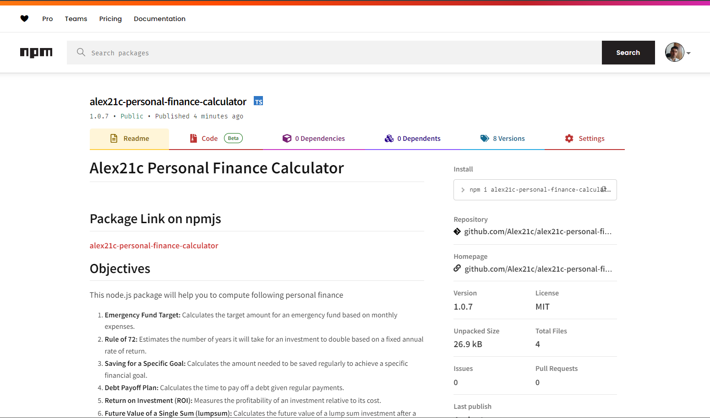

# Alex21c Personal Finance Calculator

## Package Link on npmjs
[alex21c-personal-finance-calculator](https://www.npmjs.com/package/alex21c-personal-finance-calculator)

## Objectives
This node.js package will help you to compute following personal finance 
  1. **Emergency Fund Target:** Calculates the target amount for an emergency fund based on monthly expenses.
  2. **Rule of 72:** Estimates the number of years it will take for an investment to double based on a fixed annual rate of return.
  3. **Saving for a Specific Goal:** Calculates the amount needed to be saved regularly to achieve a specific financial goal.
  4. **Debt Payoff Plan:** Calculates the time to pay off a debt given regular payments.
  5. **Return on Investment (ROI):** Measures the profitability of an investment relative to its cost.
  6. **Future Value of a Single Sum (lumpsum):** Calculates the future value of a lump sum investment after a certain number of years.
  7. **Compound Interest with Regular Contributions:** Determines the future value of investments with regular contributions.
  8. **Retirement Savings Target:** Determines the target amount to be saved for retirement.
  9. **Savings Rate:** Calculates the percentage of income saved or invested regularly.
  10. **Asset Allocation Percentage:** Helps in determining the proportion of assets to be allocated to different investment types.
 

## How to install this package in yours project
```bash
npm i alex21c-personal-finance-calculator
```

## Tech. Stack Used:
+ [NodeJS](https://nodejs.org/en/)

## make sure to add type:module in yours package.json file so that you can use import statement
```json
"type": "module"
```

## Example #1: Emergency Fund Target
```javascript
/**
 * 1. Emergency Fund Target:
 *  Emergency Fund Target = Monthly Expenses × Number of Months
 *  - Calculates the target amount for an emergency fund based on monthly expenses.
 * @param {number} monthlyExpenses : monthly expenses
 * @param {number} numberOfMonths : number of months for which to calculate emergency fund
 * @returns {number | undefined} Emergency Fund Target 
 */
import {emergencyFundTarget} from "alex21c-personal-finance-calculator";

let monthlyExpenses = 600000;
// number of months for which to calculate emergency fund
let numberOfMonths = 12;

let output = `With ₹${emergencyFundTarget(60000, 12)} Emergency fund, in case there is a job loss, i can easily support my family by spending ₹${monthlyExpenses}/month as expense for next ${numberOfMonths} months.`;
console.log(output);
```
### OUTPUT:
```
With ₹720000 Emergency fund, in case there is a job loss, i can easily support my family by spending ₹600000/month as expense for next 12 months.
```


## Example #2:  Rule of 72
```javascript
import {ruleOf72} from "alex21c-personal-finance-calculator";

/**
 * 2. Rule of 72:
 *  Years to double = 72 / annual return rate
 *  - Estimates the number of years it will take for an investment to double based on a fixed annual rate of return.
 * @param {number} annualReturnRate : annual return rate
 * @returns {number | undefined}  Years to double
 */

let annualReturnRate = 10; // percent
let output = `It would take total of ${ruleOf72(10)} years for my investment to double, if i get ${annualReturnRate}% return per year.`;

console.log(output);
````
### OUTPUT:
```
It would take total of 7.2 years for my investment to double, if i get 10% return per year.
```
  

## Example #3: Saving for a Specific Goal
```javascript
import {savingForSpecificGoal} from "alex21c-personal-finance-calculator";

/**
 * 3. Saving for a Specific Goal:
 *  Savings Needed = (Goal Amount - Current Savings) / Number of Months until Goal
 *  - Calculates the amount needed to be saved regularly to achieve a specific financial goal.
 * @param {number} goalAmount : investment goal in rupees for e.g. ₹1 Cr
 * @param {number} currentSavings : for e.g. ₹2 Lakhs
 * @param {number} numberOfMonthsUntilGoal : for e.g. 120 months = 10 years
 * @returns {number | undefined} Savings Needed
 */

let goalAmount = 10000000; //₹1 Cr
let currentSavings = 200000; //₹2 Lakhs
let numberOfMonthsUntilGoal = 120; // 10 years
let output = `I need to save ₹${savingForSpecificGoal(goalAmount, currentSavings, numberOfMonthsUntilGoal)} every month, to have ₹${goalAmount} in next ${numberOfMonthsUntilGoal/12} years`;
console.log(output);
````
### OUTPUT:
```
I need to save ₹81667 every month, to have ₹10000000 in next 10 years
```


## Example #4: Debt Payoff Plan
```javascript
import {debtPayOffPlan} from "alex21c-personal-finance-calculator";

/**
 * 4. Debt Payoff Plan:
 *  Months to Pay Off Debt = Total Debt / Monthly Payment
 *  - Calculates the time to pay off a debt given regular payments.
 * @param {number} totalDebt : total debt person is having e.g. ₹10,000/-
 * @param {number} monthlyPayment : monthly EMI payment e.g. ₹1000
 * @returns {number | undefined} Months to Pay Off Debt
 */

let totalDebt = 170000; // ₹1.7 Lakhs
let monthlyPayment = 5000; // ₹5 thousand
let output = `it would take me ${debtPayOffPlan(totalDebt, monthlyPayment)} months to clear debt of ₹${totalDebt} by paying ₹${monthlyPayment} every month.`;
console.log(output);
````
### OUTPUT:
```
it would take me 34 months to clear debt of ₹170000 by paying ₹5000 every month
```

## Example #5:  Return on Investment (ROI)
```javascript
import {roi} from "alex21c-personal-finance-calculator";

/**
 * 5. Return on Investment (ROI):
 *  ROI = (Net Profit / Cost of Investment) * 100%
 *  - Measures the profitability of an investment relative to its cost.
 * @param {number} netProfit : net profit e.g. ₹10,000/-
 * @param {number} costOfInvestment : principal amount invested e.g. ₹1 Lakh
 * @returns {number | undefined} ROI in percent
 */
let netProfit = 700000; //₹7 Lakhs
let costOfInvestment = 2000000;//₹20 Lakhs
let output = `Last year By swing trading in stock market (NSE Equity) with capital of ₹${costOfInvestment}, i made net profit of ₹${netProfit}}, thus getting ${roi(netProfit, costOfInvestment)}% return on my investment`;
console.log(output);
````
### OUTPUT:
```
Last year By swing trading in stock market (NSE Equity) with capital of ₹2000000, i made net profit of ₹700000}, thus getting 35% return on my investment
```


## Example #6: title
```javascript
code
````
### OUTPUT:
```
output
```


## Example #7: title
```javascript
code
````
### OUTPUT:
```
output
```


## Example #8: title
```javascript
code
````
### OUTPUT:
```
output
```


## Example #9: title
```javascript
code
````
### OUTPUT:
```
output
```


## Example #10: title
```javascript
code
````
### OUTPUT:
```
output
```


  
## Author
[Abhishek kumar](https://www.linkedin.com/in/alex21c/), ([Geekster](https://geekster.in/) MERN Stack FS-14 Batch)


  
  


/**
 * 7. Compound Interest with Regular Contributions:
 *   FV = P * Math.pow((1 + r), n) + PMT * ((Math.pow((1 + r), n + 1) - 1) / r) * (1 + r);
 *  Where:
 *  - FV is the future value
 *  - P is the principal investment
 *  - r is the interest rate per year
 *  - n is the number of years
 *  - PMT is regular Contribution per month
 *  - Determines the future value of investments with regular contributions.
 * @param {number} principalInvestment : e.g. ₹2 Lakh
 * @param {number} interestRatePerYear : e.g. 10%
 * @param {number} regularContribution : e.g. ₹5000 Montly contribution
 * @param {number} numberOfYears : e.g. 20 years
 * @returns {number | undefined} future value
 */
export function compoundInterestWithRegularContributions(principalInvestment=null, interestRatePerYear=null, regularContribution=null, numberOfYears=null){
  if(principalInvestment == null || interestRatePerYear == null || regularContribution == null || numberOfYears == null){
    return undefined;
  }
  
  interestRatePerYear = interestRatePerYear / 100; // Convert interest rate to decimal
  
  let r = interestRatePerYear;
  let n = numberOfYears;
  let P = principalInvestment;
  let PMT = regularContribution;
  
  // Calculate future value using the formula
  let FV = P * Math.pow((1 + r), n) + PMT * ((Math.pow((1 + r), n + 1) - 1) / r) * (1 + r);
  
  return FV;
}


/**
 * 8. Retirement Savings Target:
 *  Retirement Savings Target = desired Annual Retirement Income / Expected Investment Return Rate
 *  - Determines the target amount to be saved for retirement.
 * @param {number} desiredAnnualRetirementIncome : e.g. ₹24 Lakhs
 * @param {number} expectedInvestmentReturnRate : e.g. 10%
 : e.g. 10%
 * @returns {number | undefined} Retirement Savings Target
 */
export function retirementSavingsTarget(desiredAnnualRetirementIncome =null,  expectedInvestmentReturnRate =null){
  if(desiredAnnualRetirementIncome ==null || expectedInvestmentReturnRate ==null){
    return undefined;
  }
  
  return Math.floor(desiredAnnualRetirementIncome / (expectedInvestmentReturnRate/100));

}


/**
 * 9. Savings Rate:
 *  Savings Rate = (Amount Saved or Invested / Total Income) × 100%
 *  - Calculates the percentage of income saved or invested regularly.
 * @param {number} amountSavedOrInvested : e.g. ₹50,000/-
 * @param {number} totalIncome : e.g. ₹1 Lakh Lakhs/-
 * @returns {number | undefined} Savings Rate in percent
 */
 export function savingsRate(amountSavedOrInvested =null , totalIncome=null){
  if(amountSavedOrInvested ==null || totalIncome==null){
    return undefined;
  }
  
  return (amountSavedOrInvested / totalIncome) * 100;

}

/**
 * 10. Asset Allocation Percentage:
 *  Allocation Percentage = (Value of Asset / Total Portfolio Value) × 100%
 *  - Helps in determining the proportion of assets to be allocated to different investment types.
 * @param {number} valueOfAsset : e.g. ₹50,000/-
 * @param {number} totalPortfolioValue : e.g. ₹2 Lakhs
 * @returns {number | undefined} Allocation Percentage
 */
 export function assetAllocationPercentage(valueOfAsset =null , totalPortfolioValue=null){
  if(valueOfAsset ==null || totalPortfolioValue==null){
    return undefined;
  }
  
  return (valueOfAsset / totalPortfolioValue) * 100;

}
